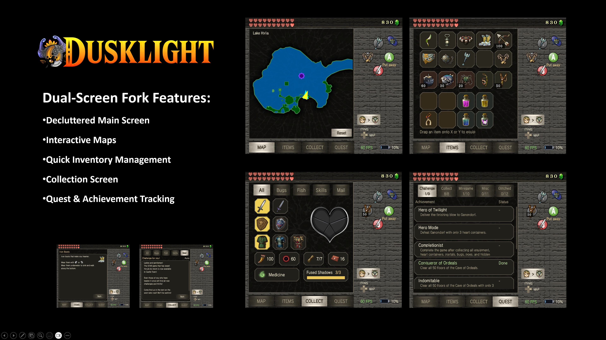

  

  

    <a href="https://twilitrealm.dev">Official Website</a>
    •
    <a href="https://discord.gg/6NpMhefCK9">Discord</a>
  

# Overview

This project is a fork of the original **Dusklight** project, specifically ported to Android and featuring a second-screen mod designed for dual-screen devices (such as the AYN Thor). 

*The original repository can be found here: [https://github.com/TwilitRealm/dusklight](https://github.com/TwilitRealm/dusklight)*

Dusklight is a reverse-engineered reimplementation of Twilight Princess. It aims to be as accurate as possible to the original while also providing new options, enhancements, and tools to customize your experience.

### Dual-Screen Features

  

  

  

This fork heavily utilizes the bottom screen to provide a more immersive and streamlined experience. Key features include:

- **Two Bottom-Screen Layouts:** Choose **Wii U Style** for a cinematic split that keeps the top screen clean, or **3DS Style** for a fully functional bottom screen modelled on the OOT3D / MM3D remakes. Switchable at any time from Settings.
- **Decluttered Main Screen:** Most HUD elements, including the controller layout, minimap, health (hearts), and rupees, have been moved to the bottom screen, leaving the top screen clean and cinematic.
- **Interactive Maps:** Features a dedicated minimap and dungeon map with icon overlays. The map is fully touch-responsive, allowing you to drag to pan and pinch to zoom.
- **Quick Inventory Management:** View item information and equip items entirely from the bottom screen.
- **2 Extra Touch Equip Slots:** Ideal for swapping items like Iron Boots on the fly while keeping your two physical buttons free.
- **Comprehensive Collection Screen:** Instantly check your progress on heart containers, caught fish, golden bugs, hidden skills, and mail. You can also swap your sword, shield, and other gear directly without ever opening the pause menu.
- **Offline Walkthrough Guide:** Save any walkthrough from zeldadungeon.net through the built-in browser and read it on the bottom screen with no connection, images included. Chapters are listed in order and expand into their sections, it remembers where you were reading, and the HUD and item buttons keep working while it is open.
- **Instant Form Toggle:** Transform between human and wolf forms instantly using a dedicated button on the bottom screen.
- **Synchronized Screen Dimming:** The bottom screen dims in step with the main screen during cutscenes and transitions, so the two never look out of sync.
- **UI Animations:** Page changes, panels and buttons on the bottom screen are animated rather than snapping, for a smoother feel.

# Setup

> [!IMPORTANT]
> Dusklight does *not* provide any copyrighted assets. You must provide your own copy of the original game.

> [!IMPORTANT]
> At a minimum, Dusklight requires a GPU with support for D3D12, Vulkan 1.1+, or Metal. For older devices, best-effort support is provided for D3D11 and OpenGL ES (Android), but will not achieve full accuracy or performance. Your experience with specific hardware, operating systems, and drivers may vary.

### 1. Dump your game

You must dump your own copy of the game. Please see [this article](https://wiki.dolphin-emu.org/index.php?title=Ripping_Games) for instructions. After dumping, you can use a program like [Dolphin](https://dolphin-emu.org/) or [nodtool](https://github.com/encounter/nod/releases) to convert the `.iso` to `.rvz` to save space.

Currently, only the GameCube USA and EUR releases are supported. Support for other versions of the game is planned in the future.

### 2. Install Dusklight

### New install, or updating from an earlier build of this fork

1. Download the APK from the release below.
2. Open it and allow installing from your browser or file manager if Android asks.
3. Launch it and point it at your game ISO.

Updating keeps everything, saves, textures, settings and guides all stay where they are.

### Coming from upstream/vanilla Dusklight

This fork shares upstream's app id but is signed with a different key, so Android will
refuse to install it over the top ("App not installed"). Upstream has to be removed
first, and **uninstalling deletes its save data**, which by default lives in internal
storage where no file manager can reach it.

So move that data somewhere safe **before** uninstalling, using upstream's own data
folder feature — not by copying files.

1. In your current Dusklight, open **Settings → Prelaunch → Data Folder** and press
   **Change Data Folder**.
2. Pick a folder on shared storage, for example `/storage/emulated/0/Dusklight`. The app
   moves your data there itself.
3. Check the folder with a file manager before going any further. You should see your
   region folder (`EUR`, `USA` or `JAP`), `config.json`, and `texture_replacements` if
   you use texture packs.
4. Uninstall Dusklight.
5. Install this fork's APK and launch it.
6. Open **Settings → Prelaunch → Data Folder → Change Data Folder** and select the same
   folder from step 2. Your saves, textures and settings come back.

If you skip step 1 and uninstall first, the saves are gone — Android deletes internal app
storage on uninstall and there is no way to recover it without root.

# Building

If you'd like to build Dusklight from source, please read the [build instructions](docs/building.md).

Pull requests are welcomed! Note that we do not accept contributions that are primarily AI-generated and will close your PR if we suspect as much. Please also see the [code conventions](docs/code-conventions.md).

# Credits

Special thanks to the [TP decompilation](https://github.com/zeldaret/tp) team, the GC/Wii decompilation community, the [Aurora](https://github.com/encounter/aurora) developers, the [TP speedrunning community](https://zsrtp.link), and all [contributors](https://github.com/TwilitRealm/dusklight/graphs/contributors).

 

    

